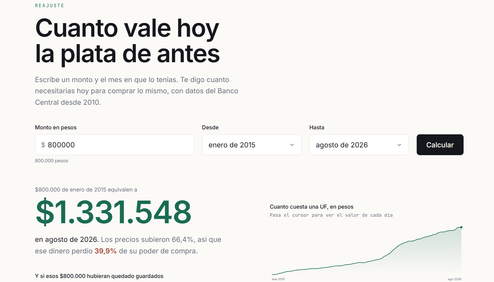

# Reajuste

Calculadora de poder adquisitivo con indicadores economicos chilenos.
Responde cuanto vale hoy una cantidad de dinero de otra epoca.

```
$800.000 de enero de 2015
equivalen a $1.331.548 en agosto de 2026
poder de compra perdido: 39,9%
```

**Python + pandas + PostgreSQL + Next.js.** Datos de
[mindicador.cl](https://mindicador.cl), sin API key.

<!-- Captura: guarda una imagen en docs/pantalla.png y descomenta esta linea

-->

---

## Como funciona

```
mindicador.cl  ->  pipeline (Python)  ->  PostgreSQL  ->  API + web (Next.js)
                        |                                        |
                   cron diario en                         calcula, compara
                   GitHub Actions                         y grafica
```

Un pipeline en Python descarga las series de 12 indicadores (UF, IPC, dolar,
UTM, IMACEC, TPM, tasa de desempleo y otros), las normaliza y las guarda en
PostgreSQL. Un cron diario mantiene los datos al dia. La app web consulta esa
base para calcular el equivalente y mostrarlo en pesos, UF, UTM y dolares.

---

## Decisiones tecnicas

Lo interesante de este proyecto no son los graficos, es lo que hay que resolver
para que los numeros sean correctos.

### El IPC no es un indice, son variaciones mensuales

La fuente entrega el IPC como el porcentaje que variaron los precios en cada
mes: `-0.2`, `0.2`, `1.0`. Para comparar dos fechas cualesquiera hay que
**encadenar** esas variaciones multiplicando, no sumando:

```
+1% en enero y +1% en febrero  =  +2,01%   (no +2%)
```

Sumarlas es el error clasico y el desvio crece con el plazo: doce meses de +1%
dan 12,68% acumulado, no 12%.

### Un mes faltante levanta excepcion

Si falta un mes en la serie, el pipeline falla en vez de rellenar el hueco. Un
mes ausente tratado como 0% produce un numero que se ve razonable y es falso, y
nadie lo nota nunca.

### La UF es el deflactor principal, el IPC es el contraste

La fuente no publica IPC del año en curso, y una calculadora que responde
"cuanto vale hoy" no puede quedarse ocho meses atras.

La UF resuelve el problema y ademas es el deflactor natural en Chile: se
reajusta a diario segun el IPC del mes anterior, o sea **ya es un indice de
precios encadenado por el Banco Central**. Por eso los arriendos y los creditos
hipotecarios estan en UF.

Calcular por ambos caminos da el mismo resultado con **0,097% de diferencia**.
Como son fuentes independientes, ese contraste valida el encadenamiento del IPC,
y por eso la app muestra los dos numeros en vez de esconder uno.

### El encadenamiento vive en un solo lugar

El indice se calcula en Python y se persiste como la serie `ipc_indice`. La API
lo lee ya listo en vez de reimplementarlo en TypeScript: duplicar esa logica en
dos lenguajes es la forma mas segura de que un dia dejen de coincidir sin que
nadie se entere.

### La UF se publica hacia el futuro

Se calcula del dia 10 de un mes al 9 del siguiente, asi que la serie contiene
fechas posteriores a hoy. Tomar `max(fecha)` como "hoy" daria un mes que todavia
no termina.

### Las fechas cambian de offset dos veces al año

La fuente entrega instantes UTC que corresponden a la medianoche de Chile:

```
2024-12-01T03:00:00.000Z   ->  1 de diciembre, horario de verano (UTC-3)
2024-09-01T04:00:00.000Z   ->  1 de septiembre, horario de invierno (UTC-4)
```

Hay que convertir a horario de Santiago antes de quedarse con la fecha, no
asumir el offset.

### La ingesta es idempotente

Corre todos los dias y vuelve a bajar meses ya guardados. La clave primaria es
`(indicador, fecha)` y cada registro se inserta o se actualiza, nunca se
duplica. Correrla diez veces deja la tabla igual que correrla una.

Verificado con la carga real: 33.497 registros, y una segunda ingesta completa
deja los conteos identicos.

### La fuente puede fallar

mindicador.cl es un servicio gratuito y sin SLA, asi que el cliente tiene
timeouts explicitos y reintentos con espera creciente. No es precaucion
teorica: dio timeout en la primera corrida real y el reintento la salvo.

---

## Correr en local

Requiere Python 3.10 o superior, Node 22 y una base PostgreSQL.
[Neon](https://neon.tech) tiene un plan gratuito que alcanza de sobra.

```bash
# Pipeline
pip install -e ".[dev]"
cp .env.example .env          # y pon ahi tu connection string

python -m pipeline ingesta --desde 2010
python -m pipeline resumen
python -m pipeline calcular --monto 800000 --desde 2015-01

# Web
cd web
npm install
cp .env.example .env.local    # el mismo connection string
npm run dev
```

`calcular` no toca la base: descarga, transforma y responde, asi que sirve para
probar el pipeline antes de configurar PostgreSQL.

---

## API

| Endpoint | Que devuelve |
| --- | --- |
| `GET /api/series/[indicador]?desde=&hasta=` | Serie historica de un indicador |
| `GET /api/convertir?monto=&desde=&hasta=` | El calculo, en pesos, UF, UTM y dolares |

Codigos de error: `400` parametros invalidos, `404` indicador inexistente,
`422` fecha fuera del rango disponible, `503` base sin configurar.

```bash
curl "http://localhost:3000/api/convertir?monto=800000&desde=2015-01"
```

---

## Estructura

```
pipeline/           Python
  fuente.py         cliente de mindicador.cl, con reintentos
  normalizar.py     JSON crudo a tabla ordenada, con foco en las fechas
  ipc.py            encadenamiento del IPC y conversion entre fechas
  uf.py             deflactor basado en UF
  db.py             esquema y escritura idempotente
  __main__.py       CLI: ingesta, resumen, calcular
tests/              53 tests
web/                Next.js 16
  app/api/          los dos endpoints
  components/       calculadora, resultado, selector de mes, grafico
  lib/              calculo puro, acceso a datos, formato chileno
  lib/calculo.test.ts   22 tests
```

Ni los tests de Python ni los de TypeScript salen a internet ni tocan la base,
asi que el CI tarda segundos y no se cae si la fuente esta abajo.

El selector de mes y el grafico son propios, sin librerias: el
`input type="month"` nativo se ve distinto en cada navegador, y el grafico son
cuatro operaciones de escala y una ruta SVG.

---

## Automatizacion

| Workflow | Cuando | Que hace |
| --- | --- | --- |
| Tests | cada push | Corre pytest y vitest, y compila el frontend |
| Ingesta diaria | 13:00 UTC | Trae el año en curso y lo guarda |

El cron solo baja el año en curso, unas 12 peticiones en vez de 200. La carga
historica se hizo una vez y el upsert idempotente se encarga del resto.

Dos cosas que conviene saber de los cron en GitHub Actions: las corridas
programadas se atrasan bastante en horarios de alta demanda, y GitHub desactiva
el schedule si el repositorio pasa 60 dias sin actividad.

---

## Licencia

MIT.
